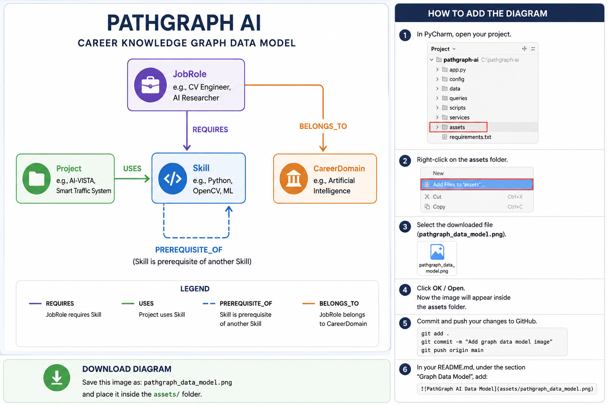

# 🧠 PathGraph AI

### Graph-Powered Career Intelligence Platform

**PathGraph AI** is an interactive career intelligence platform built with **Python, Streamlit, Cypher, and CognoDB**.

Instead of treating skills, careers, projects, and learning paths as isolated records, PathGraph AI models them as a connected **career knowledge graph**.

The platform helps users:

- 🎯 Discover career-role matches
- 🧩 Identify missing skills
- 📊 Calculate career readiness
- 🗺️ Explore multi-hop learning paths
- 🌐 Visualize the underlying knowledge graph
- 💼 Discover portfolio projects based on existing skills

---

## 🚀 Live Demo

🌐 **Live Application:**  
https://pathgraph-ai.streamlit.app

PathGraph AI is deployed using **Streamlit Community Cloud** and connected to a live **CognoDB graph database**.

The deployed application supports:

- Career Match Intelligence
- Skill Gap Analysis
- Multi-Hop Career Route Exploration
- Interactive Knowledge Graph Visualization
- Portfolio Project Discovery

> Career intelligence is generated from the relationships stored in the CognoDB knowledge graph rather than hard-coded UI results.

---

## 🎥 Demo Video

> Demo video URL will be added after recording.

---

# ✨ Core Features

## 🎯 1. Career Match Intelligence

Users select their existing technical skills and PathGraph AI compares them against the skills required by career roles stored in the CognoDB knowledge graph.

The system generates:

- Career match percentage
- Matched skills
- Missing skills
- Number of required skills
- Ranked career recommendations

### Example Input

```text
Python
Machine Learning
Deep Learning
OpenCV
TensorFlow
```

### Example Career Analysis

```text
Data Scientist               67%
Computer Vision Engineer     63%
Machine Learning Engineer    50%
Backend Developer            14%
Full-Stack Developer         14%
GenAI Engineer               13%
```

The percentages represent **skill-overlap scores within the seeded knowledge graph**, not employment or hiring probabilities.

---

## 🧩 2. Skill Gap Intelligence

Users can choose a target career role and compare its requirements with their current skill set.

Supported career roles include:

```text
Computer Vision Engineer
Machine Learning Engineer
Data Scientist
GenAI Engineer
Backend Developer
Full-Stack Developer
```

For each target career, PathGraph AI identifies:

```text
Required Skills
      ↓
Matched Skills
      ↓
Missing Skills
      ↓
Career Readiness
```

### Example

```text
Target Role:
Computer Vision Engineer

Matched:
Python
Machine Learning
Deep Learning
TensorFlow
OpenCV

Missing:
PyTorch
YOLO
Git

Career Readiness:
62%
```

This provides an actionable view of what users already know and what they should learn next.

---

## 🗺️ 3. Multi-Hop Career Route Explorer

Career development rarely happens in a single step.

PathGraph AI models skill dependencies using:

```text
(:Skill)-[:PREREQUISITE_OF]->(:Skill)
```

This enables the application to discover multi-hop learning routes through the graph.

### Example Route

```text
Python
   ↓
Machine Learning
   ↓
Deep Learning
   ↓
Computer Vision
```

Another possible route is:

```text
Python
   ↓
LLMs
   ↓
RAG
   ↓
LangChain
```

Instead of hard-coding these paths in the UI, the application traverses graph relationships to discover connected learning routes.

---

## 🌐 4. Interactive Graph Explorer

PathGraph AI includes an interactive visualization of the career knowledge graph.

The Graph Explorer allows users to inspect connections among:

- Skills
- Job Roles
- Projects
- Career Domains

Users can:

- Drag graph nodes
- Zoom and pan
- Explore connected entities
- Inspect graph structure
- Understand relationships visually

The visualization is generated using **PyVis** from graph data retrieved from CognoDB.

---

## 💼 5. Project Finder

Knowing what to learn is useful, but applying those skills is equally important.

PathGraph AI connects portfolio projects with the technologies they use:

```text
(Project)-[:USES]->(Skill)
```

The Project Finder compares a user's existing skills against project requirements and can surface:

- Matching portfolio projects
- Existing relevant skills
- Additional skills to learn
- Skill coverage

This turns career analysis into actionable portfolio-building guidance.

---

# 🧠 Why a Graph Database?

Career development is fundamentally a relationship-driven problem.

A technical skill can simultaneously:

- Be required by several job roles
- Be used by multiple projects
- Depend on another technical skill
- Connect indirectly to advanced technologies
- Contribute to different career paths

For example:

```text
Python
  │
  ├── Machine Learning
  │       │
  │       └── Deep Learning
  │                │
  │                └── Computer Vision
  │
  ├── Django
  │
  ├── Flask
  │
  └── LLMs
          │
          └── RAG
               │
               └── LangChain
```

A graph database represents these connections directly as nodes and relationships.

Using **CognoDB + Cypher**, PathGraph AI can naturally answer questions such as:

```text
Which careers best match my skills?

Which skills am I missing for a target career?

What can I learn after Python?

What multi-hop learning path leads toward Computer Vision?

Which portfolio projects use skills I already know?
```

These are graph traversal and relationship-analysis problems, making a graph database a natural fit for the application.

---

# 🕸️ Graph Data Model

PathGraph AI currently uses four primary node types.

## 🔵 Skill

Represents a technical capability.

Examples:

```text
Python
SQL
Machine Learning
Deep Learning
TensorFlow
PyTorch
OpenCV
YOLO
LLMs
RAG
LangChain
Docker
Git
REST APIs
```

---

## 🟣 JobRole

Represents a career target.

Examples:

```text
Computer Vision Engineer
Machine Learning Engineer
Data Scientist
GenAI Engineer
Backend Developer
Full-Stack Developer
```

---

## 🟢 Project

Represents a portfolio project associated with technical skills.

Projects are connected to the skills they use.

---

## 🟠 CareerDomain

Represents a broader career category associated with job roles.

---

# 🔗 Graph Relationships

PathGraph AI uses typed relationships to represent career knowledge.

```text
(JobRole)-[:REQUIRES]->(Skill)

(Project)-[:USES]->(Skill)

(Skill)-[:PREREQUISITE_OF]->(Skill)

(JobRole)-[:BELONGS_TO]->(CareerDomain)
```

| Relationship | Meaning |
|---|---|
| `REQUIRES` | Skills required for a career role |
| `USES` | Skills used by a portfolio project |
| `PREREQUISITE_OF` | Learning dependency between skills |
| `BELONGS_TO` | Career-domain classification |

---

# 📊 Graph Data Model Diagram



The diagram represents the core entities and typed relationships used by PathGraph AI.

---

# 🔍 Cypher Query Examples

PathGraph AI uses Cypher for graph retrieval, filtering, and traversal.

## 1. Career Requirements

```cypher
MATCH (role:JobRole)-[:REQUIRES]->(skill:Skill)
RETURN
    role.name AS role,
    collect(skill.name) AS required_skills;
```

This retrieves the skills associated with each career role.

---

## 2. Skill Gap Analysis

```cypher
MATCH (role:JobRole {name: $role_name})-[:REQUIRES]->(skill:Skill)

WITH collect(skill.name) AS required_skills

RETURN
    required_skills,
    [
        skill IN required_skills
        WHERE skill IN $user_skills
    ] AS matched_skills,
    [
        skill IN required_skills
        WHERE NOT skill IN $user_skills
    ] AS missing_skills;
```

User-supplied values are passed as query parameters rather than directly concatenated into Cypher.

---

## 3. Multi-Hop Learning Route

```cypher
MATCH path =
    (start:Skill {name: $start_skill})
    -[:PREREQUISITE_OF*1..4]->
    (target:Skill)

RETURN
    [node IN nodes(path) | node.name] AS route,
    target.name AS target_skill,
    length(path) AS hops;
```

This query demonstrates variable-length graph traversal.

Example result:

```text
Python
→ Machine Learning
→ Deep Learning
→ Computer Vision
```

---

## 4. Project Discovery

```cypher
MATCH (project:Project)-[:USES]->(skill:Skill)

WITH
    project,
    collect(skill.name) AS project_skills

RETURN
    project.name AS project,
    project_skills;
```

The returned project-skill relationships are used by the application to calculate project relevance.

---

## 5. Graph Explorer

The Graph Explorer retrieves connected graph data from CognoDB and transforms it into a visualization-ready structure.

```text
CognoDB
   ↓
Cypher Query
   ↓
Nodes + Relationships
   ↓
graph_service.py
   ↓
PyVis
   ↓
Interactive Graph
```

---

# 🏗️ Application Architecture

PathGraph AI follows a modular architecture separating presentation, business logic, graph queries, and database connectivity.

```text
┌──────────────────────────────────┐
│          Streamlit UI            │
│             app.py               │
└────────────────┬─────────────────┘
                 │
                 ▼
┌──────────────────────────────────┐
│          Service Layer           │
│                                  │
│  career_service.py               │
│  graph_service.py                │
│  skill_service.py                │
└────────────────┬─────────────────┘
                 │
                 ▼
┌──────────────────────────────────┐
│        Cypher Query Layer        │
│       queries/queries.py         │
└────────────────┬─────────────────┘
                 │
                 ▼
┌──────────────────────────────────┐
│             CognoDB              │
│      Career Knowledge Graph      │
└──────────────────────────────────┘
```

### UI Layer

`app.py`

Responsible for:

- Navigation
- User inputs
- Dashboard components
- Career-analysis presentation
- Graph visualization
- Project recommendations

### Service Layer

```text
services/
```

Contains the application's graph-based business logic.

### Query Layer

```text
queries/queries.py
```

Contains reusable Cypher queries.

### Database Layer

```text
config/database.py
```

Handles CognoDB connectivity using environment variables.

---

# 📁 Project Structure

```text
pathgraph-ai/
│
├── app.py
├── requirements.txt
├── README.md
├── .env.example
├── .gitignore
│
├── assets/
│   └── pathgraph_data_model.png
│
├── config/
│   ├── __init__.py
│   └── database.py
│
├── data/
│   └── seed_data.json
│
├── queries/
│   ├── __init__.py
│   └── queries.py
│
├── scripts/
│   └── seed_database.py
│
└── services/
    ├── __init__.py
    ├── career_service.py
    ├── graph_service.py
    └── skill_service.py
```

---

# 🛠️ Technology Stack

| Technology | Usage |
|---|---|
| Python | Application and graph-processing logic |
| Streamlit | Interactive web application |
| CognoDB | Managed graph database |
| Cypher | Graph queries and traversal |
| Neo4j Python Driver | Bolt-compatible database connectivity |
| PyVis | Interactive graph visualization |
| python-dotenv | Local environment configuration |
| Git & GitHub | Version control and source hosting |
| Streamlit Community Cloud | Public application deployment |

---

# ☁️ Deployment

PathGraph AI is publicly deployed using **Streamlit Community Cloud**.

### 🌐 Production Application

**https://pathgraph-ai.streamlit.app**

### Deployment Architecture

```text
GitHub Repository
        │
        ▼
Streamlit Community Cloud
        │
        ▼
PathGraph AI
        │
        ▼
Service Layer
        │
        ▼
Cypher Query Layer
        │
        ▼
CognoDB
        │
        ▼
Career Knowledge Graph
```

Production database credentials are **not stored in the GitHub repository**.

The deployed application receives the following values securely through Streamlit secrets:

```text
COGNODB_URI
COGNODB_USER
COGNODB_PASSWORD
```

For local development, the same variables are stored in a `.env` file excluded from Git using `.gitignore`.

---

# ⚙️ Local Installation

## 1. Clone the Repository

```bash
git clone https://github.com/sannith868/pathgraph-ai.git
cd pathgraph-ai
```

---

## 2. Create a Virtual Environment

### Windows

```bash
python -m venv .venv
.venv\Scripts\activate
```

### macOS / Linux

```bash
python3 -m venv .venv
source .venv/bin/activate
```

---

## 3. Install Dependencies

```bash
pip install -r requirements.txt
```

---

# 🔐 CognoDB Configuration

Create a CognoDB instance and obtain the database connection credentials.

Copy:

```text
.env.example
```

to:

```text
.env
```

Configure the following environment variables:

```env
COGNODB_URI=your_cognodb_connection_uri
COGNODB_USER=cognodb
COGNODB_PASSWORD=your_cognodb_password
```

Example structure:

```env
COGNODB_URI=bolt+s://your-instance-host:7687
COGNODB_USER=cognodb
COGNODB_PASSWORD=replace_with_your_password
```

> Never commit your real `.env` file or production database credentials.

---

# 🌱 Seed the Knowledge Graph

PathGraph AI includes deterministic seed data so the graph can be recreated.

Run:

```bash
python -m scripts.seed_database
```

Expected output:

```text
✅ PathGraph AI seed data loaded successfully!
```

The script creates the application's graph entities and relationships in CognoDB.

---

# ▶️ Run PathGraph AI Locally

Start the Streamlit application:

```bash
streamlit run app.py
```

Streamlit will provide a local URL, typically:

```text
http://localhost:8501
```

Open the URL in your browser to use PathGraph AI.

Alternatively, use the deployed version:

**https://pathgraph-ai.streamlit.app**

---

# 🔐 Security Practices

PathGraph AI avoids storing database credentials directly in source code.

Credentials are loaded from environment variables:

```text
COGNODB_URI
COGNODB_USER
COGNODB_PASSWORD
```

The real `.env` file is excluded from version control.

Production credentials are stored using Streamlit's secrets configuration rather than GitHub.

User-provided values are supplied to Cypher using query parameters where applicable instead of being directly inserted into query strings.

Example:

```python
session.run(
    query,
    role_name=role_name,
    user_skills=user_skills
)
```

This keeps query construction separate from user-provided values.

---

# 🌱 Reproducibility

The repository contains:

```text
data/seed_data.json
scripts/seed_database.py
.env.example
requirements.txt
```

Together, these allow another developer to reproduce the application:

```text
Clone Repository
       ↓
Create Environment
       ↓
Install Dependencies
       ↓
Configure CognoDB
       ↓
Seed Knowledge Graph
       ↓
Run Streamlit
```

This makes the project reproducible without exposing private database credentials.

---

# 🧪 Example Career Analysis

Input:

```text
Python
Machine Learning
Deep Learning
OpenCV
TensorFlow
```

PathGraph AI can produce ranked career matches such as:

```text
Data Scientist
67%

Computer Vision Engineer
63%

Machine Learning Engineer
50%
```

For a Computer Vision Engineer target:

```text
Required Skills: 8

Matched Skills:
✓ Python
✓ Machine Learning
✓ Deep Learning
✓ TensorFlow
✓ OpenCV

Missing Skills:
○ PyTorch
○ YOLO
○ Git

Career Readiness:
62%
```

The application can then traverse the knowledge graph to identify learning routes toward missing or related skills.

---

# 🎯 Example User Journey

Try the application:

**https://pathgraph-ai.streamlit.app**

A user selects:

```text
Python
Machine Learning
Deep Learning
OpenCV
TensorFlow
```

PathGraph AI then performs:

```text
User Skills
     ↓
CognoDB Graph Query
     ↓
Career Match
     ↓
Skill Gap Analysis
     ↓
Career Readiness
     ↓
Multi-Hop Learning Routes
     ↓
Project Recommendations
     ↓
Interactive Graph Exploration
```

This creates a connected career-development workflow powered by graph relationships rather than isolated recommendations.

---

# 📸 Application Screenshots

Screenshots can be added to the repository to demonstrate the deployed application.

Recommended screenshots:

```text
1. PathGraph AI Dashboard
2. Career Match Intelligence
3. Skill Gap Analysis
4. Career Route Explorer
5. Interactive Graph Explorer
6. Project Finder
```

---

# 💡 Design Philosophy

PathGraph AI was designed around one central idea:

> **Career development is not a list — it is a graph.**

Skills connect to other skills.

Skills connect to careers.

Projects connect to skills.

Careers connect to broader domains.

By modeling these relationships explicitly, PathGraph AI can perform graph traversal and relationship-based analysis that would be less natural with isolated tabular records.

---

# 🚧 Current Scope

PathGraph AI currently uses a curated seed dataset designed to demonstrate:

- Graph data modeling
- Typed relationships
- Cypher queries
- Parameterized queries
- Multi-hop traversal
- Skill-gap analysis
- Career matching
- Project discovery
- Interactive graph visualization
- Cloud deployment

Career-match percentages are calculated from skill overlap within the seeded knowledge graph.

They should **not** be interpreted as hiring probabilities, employment predictions, or guarantees.

---

# 🔮 Future Improvements

Potential future extensions include:

- 📄 Resume-based automatic skill extraction
- 🤖 LLM-assisted career explanations
- 🧭 Personalized learning roadmaps
- 📚 Course recommendations
- 🌎 Larger career knowledge graphs
- 💼 Live job-market integration
- 🔎 Semantic skill matching
- 🧠 Graph embeddings
- 👤 User profiles
- 💾 Saved career plans
- 📈 Career-progress tracking
- 🔗 External learning-resource integration

---

# 👨‍💻 Author

**Govind Sannith Reddy**

Computer Science / AI & Machine Learning

GitHub: `sannith868`

---

# 📄 Assessment Project

PathGraph AI was developed as a technical assessment project demonstrating practical use of:

```text
Python
Streamlit
CognoDB
Cypher
Graph Modeling
Graph Traversal
Interactive Visualization
Cloud Deployment
Software Engineering
```

---

## 🔗 Quick Links

**Live Application:**  
https://pathgraph-ai.streamlit.app

**GitHub Repository:**  
https://github.com/sannith868/pathgraph-ai

---

⭐ **PathGraph AI — Navigate your career with graph intelligence.**